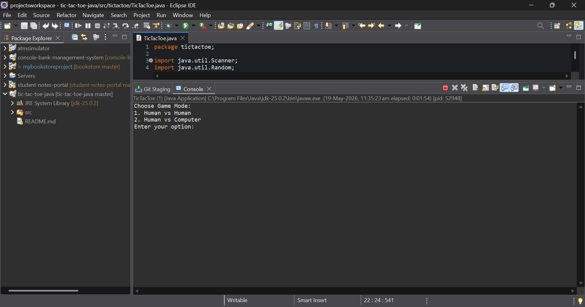
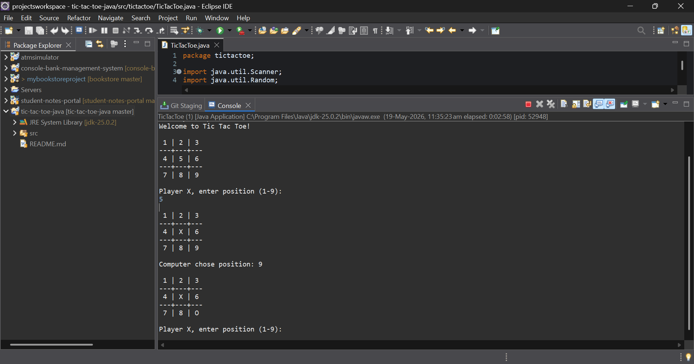
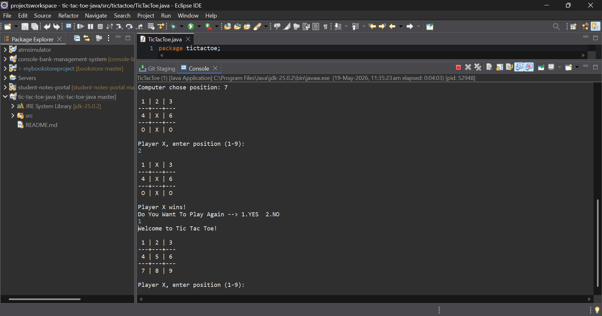
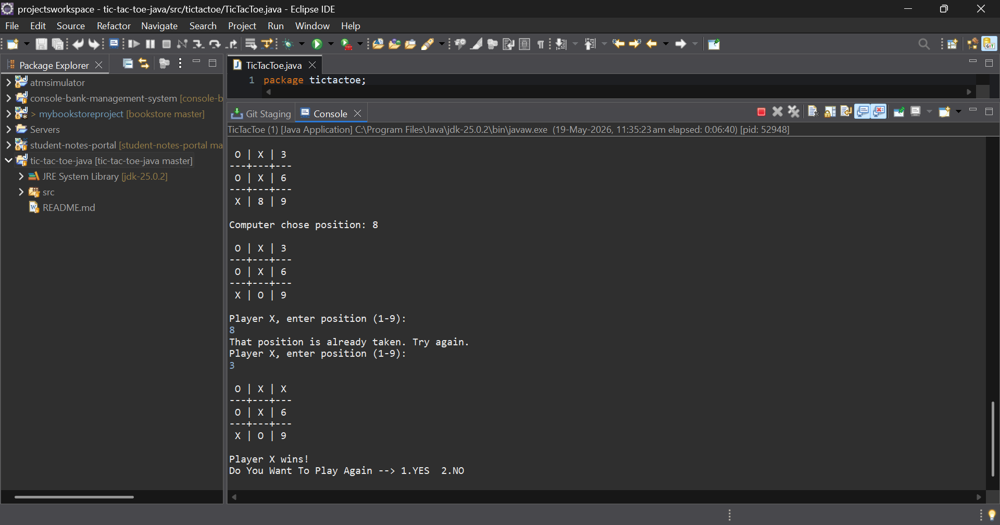

# Tic Tac Toe Game in Java

A two-player console-based Tic Tac Toe game developed using Java and basic OOP concepts.

## Features

-  Multiplayer console gameplay for two users
- Input validation
- Win condition checking
- Draw condition checking
- Dynamic board updates
- Replay option
- Human vs human gameplay mode
- Human vs computer gameplay mode

## Screenshots

### Game Mode Selection



### Gameplay



### Replay Option




### Validation




## Technologies Used

- Java
- Arrays
- Loops
- Conditional statements
- OOP(Object Oriented Programming language) basics

## Project Structure

```text
src/
└── tictactoe/
    └── TicTacToe.java
```

## Concepts Practiced

- Arrays
- Methods
- Conditional logic
- User input handling
- Game logic implementation

## Future Improvements

- GUI version
- Score tracking